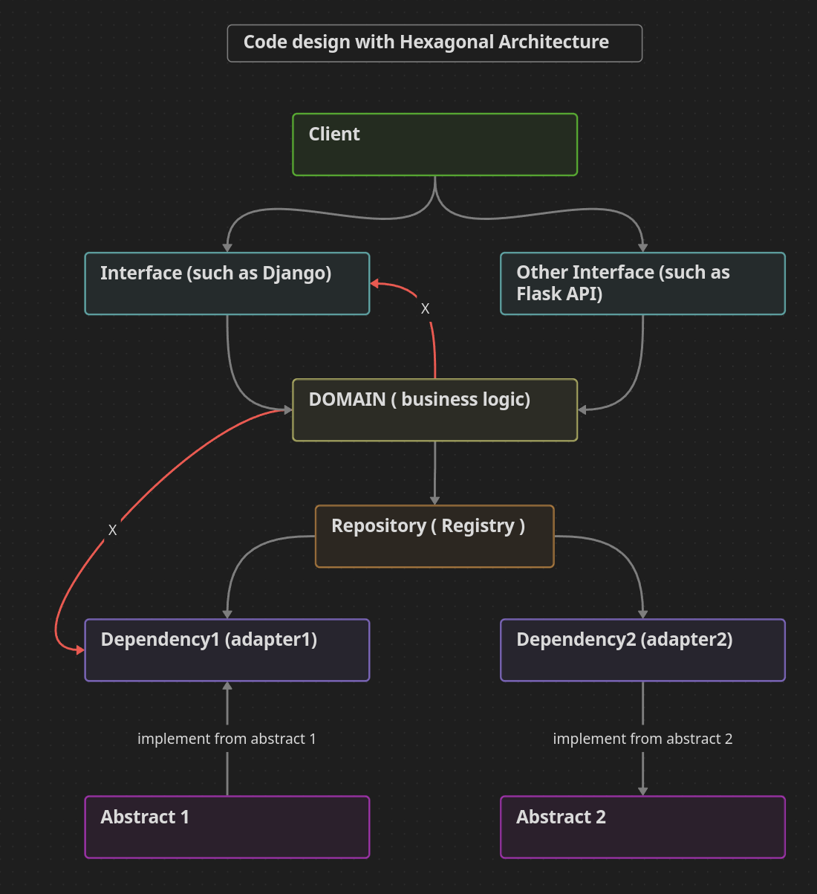
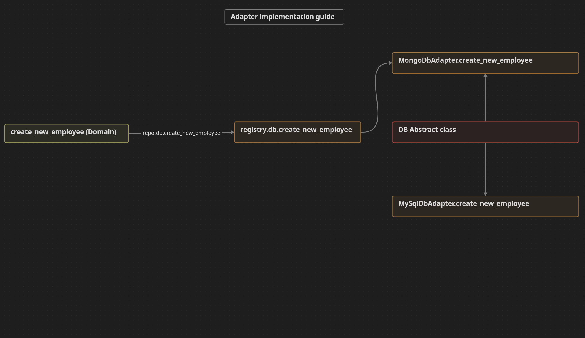

# Employee-management-application
Employee management application

## Requirement
- Login endpoint with authentication
- Employee endpoint with crud operation
	- create new employee endpoint 
	- read employee data endpoint (get all)
	- update employee endpoint 
	- delete ( terminate ) employee endpoint
- Position endpoint with crud operation 
	- create new position endpoint 
	- read position data endpoint (get all)
	- update position data endpoint 
	- delete position endpoint (with condition it should not already use)
- Department endpoint with crud operation 
	- create new department endpoint 
	- read department data endpoint (get all)
	- update department data endpoint
	- delete department endpoint (with condition it should not already use) 
- Status endpoint with crud operation
	- create new status endpoint 
	- read status data endpoint (get all) 
	- update status data endpoint 
	- delete status endpoint (with condition it should not already use)
- Advance query endpoint 
	- query with dynamic filter such as position, department and status

## Project structure guideline
```
.
├── handler                             # handler store all handler process that handle code life cycle such as api endpoint or process
│   ├── event_handler.py                # store event handler code such as dependency injection
│   ├── inputbd                         # store all input that come from client such as request body
│   │   └── input1.py                   # input body 1 for use case 1
│   ├── process or endpoint             # store endpoint or something that attach use case
│   │   ├── endpoint1.py                # endpoint 1 that attach use case 1
│   │   └── process1.py                 # process 1 that attach use case 1
│   └── run.py                          # run file for start this project
├── hexagonalmodel                      # this folder contain all core domain such as business logic, dependency, aggregate data
│   ├── adapter                         # this folder contain adapter (dependency) that use in any use case such as database, mqtt, redis
│   │   ├── production                  # this folder contain production adapter 
│   │   │   ├── prodadapter1.py         # store production adapter 1 that implement by hexagonalmodel/port/abstrac1.py
│   │   │   └── prodadapter2.py         # store production adapter 2 that implement by hexagonalmodel/port/abstrac2.py
│   │   └── test                        # this folder contain test adapter that use in unit test
│   │       ├── mockadapter1.py         # store mockadapter 1 that implement by hexagonalmodel/port/abstrac1.py
│   │       └── mockadapter2.py         # store mockadater 2 that implement by hexagonalmodel/port/abstrac2.py
│   ├── domain                          # this folder contain all core domain such as usecase (business logic)
│   │   ├── base                        # this folder contain base file 
│   │   │   ├── exception.py            # store custom execption
│   │   │   ├── logging.py              # store custom logging object
│   │   │   ├── registry.py             # store repository that call by usecase (business logic)
│   │   │   ├── singleton.py            # store singleton class (meta class of registry) that make registry are global
│   │   │   └── utils.py                # store utilize function such as pack data function
│   │   ├── model                       # contain model that use in this project such as zigbee command model or aggregate model
│   │   │   ├── model1.py               # model 1
│   │   │   └── model2.py               # model 2
│   │   └── usecase                     # this folder contain use case (business logic)
│   │       ├── usecase1.py             # business logic 1 
│   │       └── usecase2.py             # business logic 2
│   └── port                            # this folder contain abstract class of dependency that use in this project
│       ├── abstract1.py                # abstract class 1 for dependency 1
│       └── abstract2.py                # abstract class 2 for dependency 2
└── infrastructure                      # this folder contain all config file
    ├── config                          # config folder
    │   └── config.json                 # config file
    ├── database                        # database config folder
    │   └── databaseuri.py              # store database probperty such as database URI or connection code
    └── environment                     # store environment config file
    │   └── .env                        # environment file
├── test                                # this folder contain all unit test 
│   └── test_usecase1_dosomething.py    # store test case of usecase1
|   └── test_usecase2_dosomething2.py   # store test case of usecase2
```
## Code design diagram



## Adapter implementation guideline



## Code pattern description 

This project follow with TDD,SOLID and Hexagonal Architecture all of them enhance this project for more readable, maintainable and flexible 

## Run unit test 

```
pytest tests
```